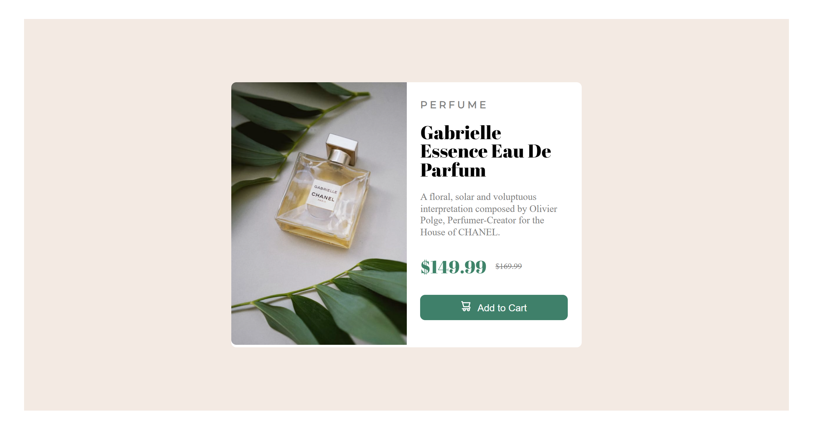
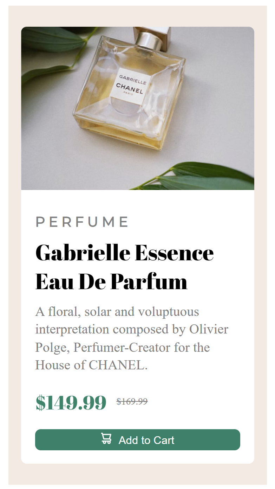

# Frontend Mentor - Product preview card component solution

This is a solution to the [Product preview card component challenge on Frontend Mentor](https://www.frontendmentor.io/challenges/product-preview-card-component-GO7UmttRfa).

## Table of contents

- [Overview](#overview)
  - [The challenge](#the-challenge)
  - [Screenshot](#screenshot)
  - [Links](#links)
- [My process](#my-process)
  - [Built with](#built-with)
  - [What I learned](#what-i-learned)
  - [Things to learn](#things-to-learn)
  - [Useful resources](#useful-resources)
- [Author](#author)


**Note: Delete this note and update the table of contents based on what sections you keep.**

## Overview

### The challenge

Users should be able to:

- View the optimal layout depending on their device's screen size
- See hover and focus states for interactive elements

### Screenshot




### Links

- Solution URL: [GitHub repository](https://github.com/ShashiKPD/product-preview-card)
- Live Site URL: [GitHub Page link](https://shashikpd.github.io/product-preview-card/)

## My process

### Built with

- HTML
- CSS properties
- Responsive using CSS media query
- Mobile-first workflow

### What I learned

I learned about some new HTML tags while building this project. One of the tag is:

```html
<del>$169.99</del>
```
I learned that a screen reader software would not read out loud any text inside ``` <del> ``` tag. So, it can be used instead of "text-decoration: line-through" CSS property when needed.

I also learned some new CSS properties like ``` display: none ``` property to hide mobile-version-image in desktop and vice versa in mobile.

I also got to practice ``` relative ``` and ``` absolute ``` CSS property.

An another thing I got to learn is how to centre a div vertically inside another div.
```CSS
.product-price{
  vertical-align: middle;
}
```

### Things to learn

In the upcoming projects, I would try to make website responsive using CSS grid property.
I plan to incorporate HTML semantic elements and CSS custom properties in my projects.

### Useful resources

- [Hubspot center-div-css](https://blog.hubspot.com/website/center-div-css) - This is an amazing article which helped me understand CSS centre property. I'd recommend it to anyone still learning this concept.
- [W3Schools display-css](https://www.w3schools.com/cssref/pr_class_display.php) - I had a lot of confusion in this concept. This W3Schools article helped me clear it.

## Author

- My links - [@ShashiKPD](https://shashikpd.bio.link/)
- LinkedIn - [@ShashiKPD](https://www.linkedin.com/in/shashikpd/)
- Frontend Mentor - [@ShashiKPD](https://www.frontendmentor.io/profile/ShashiKPD)
- Twitter - [@Shashi_KPD](https://twitter.com/Shashi_KPD)
